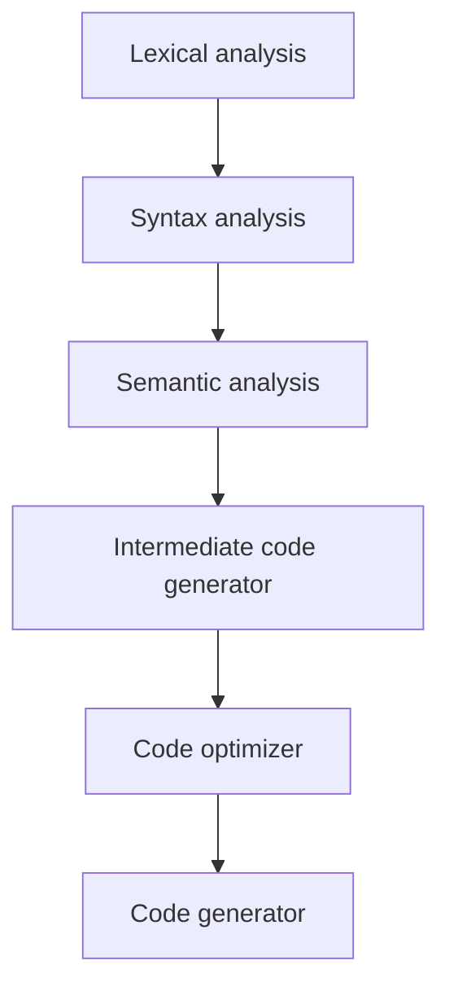

# [TODO PROJECT NAME]

A custom scripting language with simple and familiar C-like syntax, mostly built as a fun exercise.

## Example Code

```code
let a = 5;
let b = 5;

a = 10;

if (a + b < 12) {
    print(a);
} else {
    print(25);
}

while(a < 10) {
    print(a);
    a = a + 1;
}
```

## Compiler Details

The compiler uses LLVM as its backend allowing it to quickly target a wide range of architectures and make use of existing optimisation passes. A compiler typically consists of six stages illustrated below, LLVM handles the intermediate code generation, optimization and final code generation for us. This frees up developers to focus on the frontend rather than getting bogged down on the mituate such as register allocation.



Furthermore, since LLVM IR is targeted by many other mature languages such as C/C++ (with the clang compiler), Haskell, Rust and more, this allows us to reuse many of the tools (language servers, formatter, linters) and optimations developed there. In many ways, the LLVM IR can be seen in a similar light to the Java byte code, for a more in-depth understanding of the architecture and rationale behind LLVM have a read through [this](http://www.aosabook.org/en/llvm.html).

## Lexical Analysis

Lexical analysis is performed using a custom lexer which scans the input file for valid tokens whilst keeping track of line and column postions for error reporting.

## Syntax Analysis

Syntax analysis is handled by a predefined [Context Free Grammar](https://en.wikipedia.org/wiki/Context-free_grammar) (CFG), this is defined in a separate `grammar.y` file which is used by [YACC/Bison](https://www.gnu.org/software/bison/) to produce a corresponding [push down automaton](https://en.wikipedia.org/wiki/Pushdown_automaton); This can then be used by a parser for semantic analysis to produce an Abstract Syntax Tree (AST).

### Context Free Grammar

Below is the grammar definition that dictates what is and isn't valid syntax, also note the operator precedences to avoid shift/reduce conflicts.

```
%nonassoc NO_ELSE
%nonassoc ELSE
%right ASSIGN
%left LE GE EQ NE OR AND
%left '+' '-'
%left '*' '/'
%right UMINUS
%left '(' ')'

program :  /* empty */
     | program statement { YYlex.(*Lexer).codeGen($2) } 
     ;

statement:
     expression SEPARATOR
     | assignment SEPARATOR
     | reassignment SEPARATOR
     | print SEPARATOR
     | control_flow
     | while_statement
     ;

statements:
     statement statements
     | statement
     ;

expression:
     NUMBER 
    | IDENTIFIER 
    | expression '+' expression 
    | expression '-' expression 
    | expression '*' expression 
    | expression '/' expression 
    | expression LE expression 
    | expression GE expression 
    | expression EQ expression 
    | expression NE expression 
    | expression OR expression 
    | expression AND expression 
    | '(' expression ')'  
    | '-' expression %prec UMINUS 
    ;
    
assignment:
     LET IDENTIFIER ASSIGN expression 
     ;

reassignment:
     IDENTIFIER ASSIGN expression 
     ;

print:
     PRINT '(' expression ')' 
     ;

control_flow:
     IF '(' expression ')' '{' statements '}'  %prec NO_ELSE 
     | IF '(' expression ')' '{' statements '}' ELSE 
     ;

while_statement:
     WHILE '(' expression ')' '{' statements '}' 
```

## Semantic analysis

Semantic is handled by a parser which populates an Abstract Syntax Tree (AST) to be used for code generation. The parser itself is a [LALR](https://en.wikipedia.org/wiki/LALR_parser) (Look-Ahead LR parser) parser, where "LR" means left-to-right and produces a rightmost derivation.

The parser itself is generated using a parser generator due to the large number of combinations and complexity involved in creating a handwritten parser.

Once parsing is complete and a valid AST is generated, this can be recursively traversed whilst generating corresponding LLVM IR.

